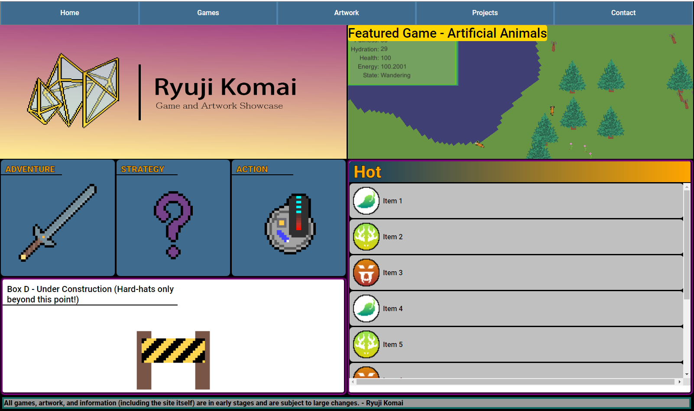
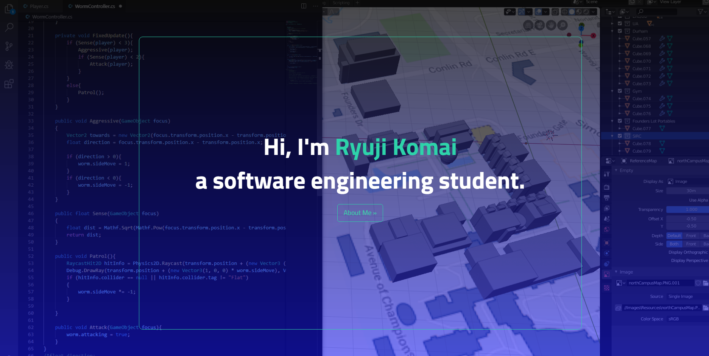

# paivi1.github.io
Practice building a website

Contains the two portfolio site's I made from scratch before eventually moving to WordPress.

<h2>The First Site</h2>
Not really much to write home about, but at the time I was using Unity and Game Development as a way to understand and learn programming. Since I had made a couple of small half-games, I thought it'd be fun to make my portoflio site in the style of a common 2000s-era flash game website. Coding practice aside, piecing together the games had given me a real undestanding of where all those games I played when I was younger had come from. The larger sites had been managed and monetized by many, but some of the smaller sites such as 'LostVectors.com' may have very well been a single-manned effort to create a portfolio of the ~10 games he had made.

<h2>The Second Site</h2>
Coding more than games and forcing myself to be more professional, I wanted to redo it all. I wanted to practice using Bootstrap, which I had recently learned, on top of the  vanilla JS I had been using previously. I also wanted to make it look more sleek (in contrast to what I had before).

It's actually still hosted on Github and can be accessed here: https://paivi1.github.io/

